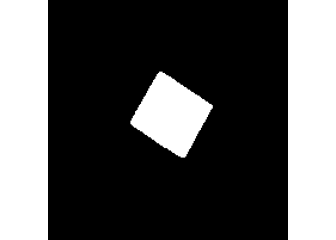
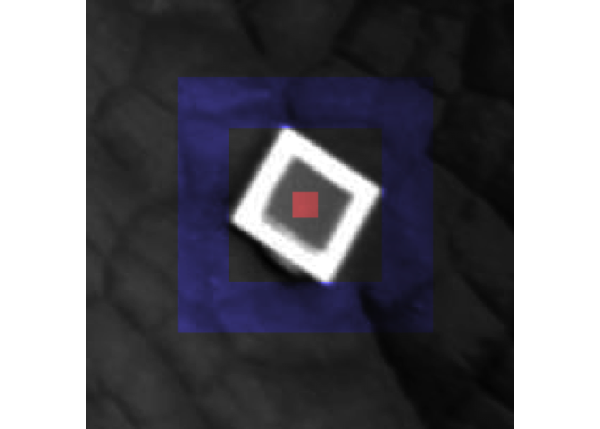
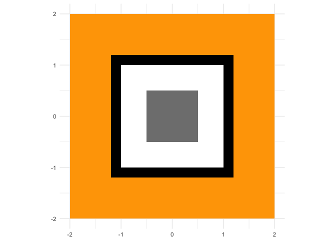
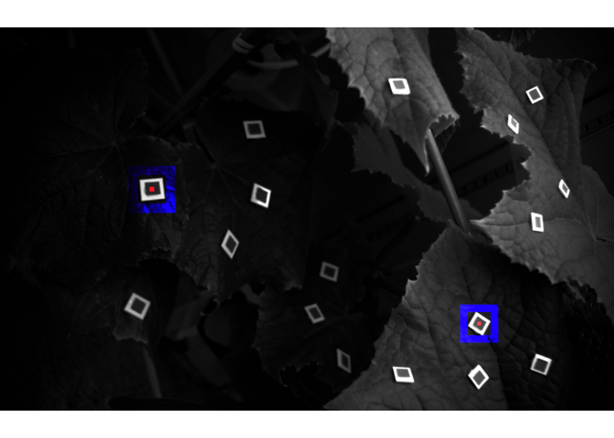

    library(tidyverse)
    knitr::opts_chunk$set(echo = TRUE, warning = FALSE)
    # load core functions and libraries
    library(dualband)
    library(imager)
    library(EBImage)
    library(pri)
    set_read_img("jpg")

Demo
====

Pre-processing
--------------

    (img_files <- dir("sample_data/", full.names = T))

    ## [1] "sample_data//img1.jpg" "sample_data//img2.jpg"

    img_demo <-
      img_files %>%
      read_imgs %>%
      .^3 # correct gamma value

    dualband::show(img_demo, browser = F, all = F)

    ## Only the first frame of the image stack is displayed.
    ## To display all frames use 'all = TRUE'.

Divide images into small pieces
-------------------------------

To divide images, the locations should be approximated.

    location_demo <-
      tribble(
         ~ x,  ~ y, ~ size, ~ location,
         474,  501,    100,    "a",
        1497,  933,    100,    "b"
      )
    location_demo

    ## # A tibble: 2 x 4
    ##       x     y  size location
    ##   <dbl> <dbl> <dbl>    <chr>
    ## 1   474   501   100        a
    ## 2  1497   933   100        b

The images are divided into a list of small images---called pieces.

    piece_demo <-
      location_demo %>%
      split(.$location) %>%
      map(~ divide_piece(., img_demo))

Detect markers
--------------

Determine a center of the marker with `set_center`. A binarised piece
can be checked as the side-effect (`.check = T`). This function appends
attributes related to binarisation, eroding, and geomery of
white-reflectance to the input image. That is, only attributes will be
changed. Returns `NULL` when the `.check = T`.

    piece_demo %>%
      map(~ set_center(., .check = T, browser = F,
                       white_ratio = .95, erode_size = 1, occupancy = .001))

    ## $a
    ## NULL
    ## 
    ## $b
    ## NULL

    piece_demo_1 <-
      piece_demo %>%
      map(~ set_center(., .check = F, browser = F,
                       white_ratio = .95, erode_size = 1, occupancy = .001))

-   white\_ratio (0--1)
    -   bright pixels within top `X%` are regarded as the white regions.
-   erode\_size (int)
    -   if the white regions are separated, the regions may be merged by
        increasing this factor.
-   occupancy (0--1)
    -   smaller regions can be removed by increasing this factor
        although the smaller regions do not count as long as a true
        white region is the largest.

Set ROIs
--------

Determine the ROIs with `set_masks`. A masked piece can be checked as
the side-effect (`.check = T`). This function appends attributes related
to ROIS to the input image. That is, only attributes will be changed.
Returns `NULL` when the `.check = T`.

    piece_demo_1 %>%
      map(~ set_masks(., .check = T, browser = F,
                      ref_white_ratio = 1/5, margin_white_ratio = 1.2, outer_white_ratio = 2))

    ## Only the first frame of the image stack is displayed.
    ## To display all frames use 'all = TRUE'.
    ## Only the first frame of the image stack is displayed.
    ## To display all frames use 'all = TRUE'.

    ## $a
    ## NULL
    ## 
    ## $b
    ## NULL

    piece_demo_2 <-
      piece_demo_1 %>%
      map(~ set_masks(., .check = F, browser = F,
                      ref_white_ratio = 1/5, margin_white_ratio = 1.2, outer_white_ratio = 2))

-   ref\_white\_ratio (0--1)
    -   grey / white
-   margin\_white\_ratio ( &gt; 1)
    -   black / white
-   outer\_white\_ratio ( &gt; margin\_white\_ratio)
    -   orange / white

Summarise marker data
---------------------

Statistics can be summarised by `extract_reflectance`.

    piece_demo_2 %>%
      map(extract_reflectance)

    ## $a
    ##   file median_marker mean_marker median_target mean_target median_refl
    ## 1 img1     0.1838584   0.1827335    0.03448369  0.04125444   0.1875557
    ## 2 img2     0.1800806   0.1815917    0.03448369  0.04144903   0.1914903
    ##   mean_refl z
    ## 1 0.2257629 1
    ## 2 0.2282540 2
    ## 
    ## $b
    ##   file median_marker mean_marker median_target mean_target median_refl
    ## 1 img1     0.3756928   0.3722550     0.1654869   0.1711268   0.4404845
    ## 2 img2     0.3576146   0.3561011     0.1619660   0.1642440   0.4529066
    ##   mean_refl z
    ## 1 0.4597030 1
    ## 2 0.4612286 2

Check mapping
-------------

Map reference (i.e. reflectance standard) and target (i.e. leaf) regions
on the input image.

    masked_pieces_demo <-
      piece_demo_2 %>%
      # adjust mapping colors and pixel values
      map(check_mask, map_rgb = c(marker = 1, target = 3), map_int = c(marker = 10, target = 10))

    masked_full_demo <-
      map_full(list_pieces = masked_pieces_demo, full_size_img = img_demo)

    dualband::show(masked_full_demo, browser = F)

    ## Only the first frame of the image stack is displayed.
    ## To display all frames use 'all = TRUE'.

Session information
===================

    devtools::session_info()

    ## Session info --------------------------------------------------------------

    ##  setting  value                       
    ##  version  R version 3.3.1 (2016-06-21)
    ##  system   x86_64, darwin13.4.0        
    ##  ui       X11                         
    ##  language (EN)                        
    ##  collate  en_US.UTF-8                 
    ##  tz       Asia/Tokyo                  
    ##  date     2018-02-28

    ## Packages ------------------------------------------------------------------

    ##  package      * version    date      
    ##  abind          1.4-5      2016-07-21
    ##  assertthat     0.2.0      2017-04-11
    ##  backports      1.0.4      2016-10-24
    ##  bindr          0.1        2016-11-13
    ##  bindrcpp     * 0.2        2017-06-17
    ##  BiocGenerics   0.20.0     2017-04-20
    ##  bmp            0.2        2013-08-10
    ##  broom          0.4.3      2017-11-20
    ##  cellranger     1.1.0      2016-07-27
    ##  cli            1.0.0      2017-11-05
    ##  colorspace     1.2-6      2015-03-11
    ##  crayon         1.3.4      2017-09-16
    ##  devtools       1.12.0     2016-06-24
    ##  digest         0.6.13     2017-12-14
    ##  dplyr        * 0.7.4      2017-09-28
    ##  dualband     * 0.1.0      2018-02-28
    ##  EBImage      * 4.16.0     2017-04-20
    ##  evaluate       0.10.1     2017-06-24
    ##  fftwtools      0.9-8      2017-03-25
    ##  forcats      * 0.2.0      2017-01-23
    ##  ggplot2      * 2.2.1.9000 2018-02-13
    ##  glue           1.2.0      2017-10-29
    ##  gtable         0.2.0      2016-02-26
    ##  haven          1.1.0      2017-07-09
    ##  hms            0.3        2016-11-22
    ##  htmltools      0.3.6      2017-04-28
    ##  httr           1.3.1      2017-08-20
    ##  imager       * 0.40.2     2017-04-24
    ##  jpeg           0.1-8      2014-01-23
    ##  jsonlite       1.5        2017-06-01
    ##  knitr          1.17       2017-08-10
    ##  labeling       0.3        2014-08-23
    ##  lattice        0.20-33    2015-07-14
    ##  lazyeval       0.2.1      2017-10-29
    ##  locfit         1.5-9.1    2013-04-20
    ##  lubridate      1.7.1      2017-11-03
    ##  magrittr     * 1.5        2014-11-22
    ##  memoise        1.0.0      2016-01-29
    ##  mnormt         1.5-4      2016-03-09
    ##  modelr         0.1.1      2017-07-24
    ##  munsell        0.4.3      2016-02-13
    ##  nlme           3.1-128    2016-05-10
    ##  pkgconfig      2.0.1      2017-03-21
    ##  plyr         * 1.8.4      2016-06-08
    ##  png            0.1-7      2013-12-03
    ##  pri          * 0.1.0      2017-11-19
    ##  psych          1.6.6      2016-06-28
    ##  purrr        * 0.2.4      2017-10-18
    ##  R6             2.2.2      2017-06-17
    ##  Rcpp           0.12.14    2017-11-23
    ##  readbitmap     0.1-4      2014-09-05
    ##  readr        * 1.1.1      2017-05-16
    ##  readxl         1.0.0      2017-04-18
    ##  reshape2       1.4.3      2017-12-11
    ##  rlang          0.1.6.9003 2018-02-13
    ##  rmarkdown      1.6        2017-06-15
    ##  rprojroot      1.2        2017-01-16
    ##  rstudioapi     0.7        2017-09-07
    ##  rvest          0.3.2      2016-06-17
    ##  scales         0.5.0.9000 2017-12-23
    ##  stringi        1.1.6      2017-11-17
    ##  stringr      * 1.3.0      2018-02-19
    ##  tibble       * 1.3.4      2017-08-22
    ##  tidyr        * 0.8.0      2018-01-29
    ##  tidyverse    * 1.2.1      2017-11-14
    ##  tiff           0.1-5      2013-09-04
    ##  withr          2.1.1.9000 2017-12-23
    ##  xml2           1.1.1      2017-01-24
    ##  yaml           2.1.14     2016-11-12
    ##  source                                 
    ##  CRAN (R 3.3.0)                         
    ##  cran (@0.2.0)                          
    ##  cran (@1.0.4)                          
    ##  cran (@0.1)                            
    ##  CRAN (R 3.3.2)                         
    ##  Bioconductor                           
    ##  CRAN (R 3.3.0)                         
    ##  CRAN (R 3.3.2)                         
    ##  cran (@1.1.0)                          
    ##  CRAN (R 3.3.2)                         
    ##  CRAN (R 3.3.1)                         
    ##  CRAN (R 3.3.2)                         
    ##  CRAN (R 3.3.0)                         
    ##  cran (@0.6.13)                         
    ##  cran (@0.7.4)                          
    ##  Github (KeachMurakami/dualband@c320f18)
    ##  Bioconductor                           
    ##  cran (@0.10.1)                         
    ##  CRAN (R 3.3.2)                         
    ##  CRAN (R 3.3.2)                         
    ##  Github (thomasp85/ggplot2@7859a29)     
    ##  cran (@1.2.0)                          
    ##  CRAN (R 3.3.1)                         
    ##  CRAN (R 3.3.2)                         
    ##  CRAN (R 3.3.1)                         
    ##  cran (@0.3.6)                          
    ##  CRAN (R 3.3.2)                         
    ##  CRAN (R 3.3.2)                         
    ##  CRAN (R 3.3.0)                         
    ##  cran (@1.5)                            
    ##  cran (@1.17)                           
    ##  CRAN (R 3.3.1)                         
    ##  CRAN (R 3.3.1)                         
    ##  cran (@0.2.1)                          
    ##  CRAN (R 3.3.0)                         
    ##  CRAN (R 3.3.2)                         
    ##  CRAN (R 3.3.1)                         
    ##  CRAN (R 3.3.1)                         
    ##  CRAN (R 3.3.0)                         
    ##  CRAN (R 3.3.2)                         
    ##  CRAN (R 3.3.1)                         
    ##  CRAN (R 3.3.1)                         
    ##  cran (@2.0.1)                          
    ##  CRAN (R 3.3.1)                         
    ##  CRAN (R 3.3.0)                         
    ##  Github (KeachMurakami/pri@8673b65)     
    ##  CRAN (R 3.3.0)                         
    ##  cran (@0.2.4)                          
    ##  cran (@2.2.2)                          
    ##  cran (@0.12.14)                        
    ##  CRAN (R 3.3.0)                         
    ##  CRAN (R 3.3.2)                         
    ##  CRAN (R 3.3.2)                         
    ##  cran (@1.4.3)                          
    ##  Github (tidyverse/rlang@616fd4d)       
    ##  CRAN (R 3.3.2)                         
    ##  cran (@1.2)                            
    ##  CRAN (R 3.3.2)                         
    ##  CRAN (R 3.3.0)                         
    ##  Github (hadley/scales@d767915)         
    ##  CRAN (R 3.3.2)                         
    ##  CRAN (R 3.3.1)                         
    ##  cran (@1.3.4)                          
    ##  CRAN (R 3.3.1)                         
    ##  CRAN (R 3.3.1)                         
    ##  CRAN (R 3.3.0)                         
    ##  Github (jimhester/withr@df18523)       
    ##  cran (@1.1.1)                          
    ##  cran (@2.1.14)
